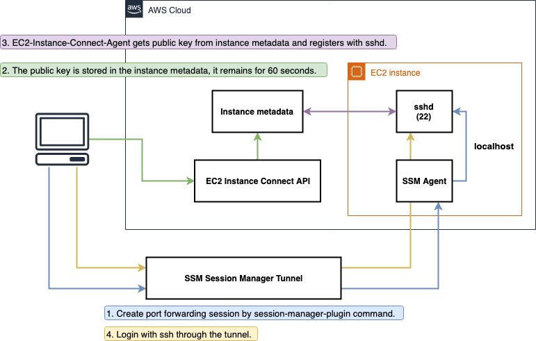

# awssh

[](https://goreportcard.com/report/github.com/youyo/awssh)

CLI tool to login ec2 instance.

- You can close the ssh port in the security group.
- It is not necessary to register the ssh public key.
- You don't need to know public ip of ec2 instance.

## Architecture



## Install

- Brew

```
$ brew tap youyo/tap
$ brew install awssh
```

Other platforms are download from [github release page](https://github.com/youyo/awssh/releases).

## Requirements

- `ec2-instance-connect` must be possible. See https://docs.aws.amazon.com/AWSEC2/latest/UserGuide/ec2-instance-connect-set-up.html
- `port forwarding with amazon-ssm-agent` must be possible. See https://docs.aws.amazon.com/systems-manager/latest/userguide/session-manager.html
- `session-manager-plugin` command. See https://docs.aws.amazon.com/systems-manager/latest/userguide/session-manager-working-with-install-plugin.html

## IAM Policy

```
{
    "Version": "2012-10-17",
    "Statement": [
        {
            "Effect": "Allow",
            "Action": [
                "ec2-instance-connect:SendSSHPublicKey",
                "ssm:StartSession",
                "ec2:DescribeSubnets",
                "ec2:DescribeInstances",
                "ec2:DescribeTags"
            ],
            "Resource": "*"
        }
    ]
}
```


## Usage

```bash
$ awssh
```


```bash
$ awssh --help
CLI tool to login ec2 instance.

Usage:
  awssh [instance-id] [flags]

Flags:
      --cache                     enable cache a credentials.
      --duration string           cache duration. (default "1 hour")
  -c, --external-command string   feature use.
  -h, --help                      help for awssh
  -i, --identity-file string      identity file path. (default "~/.ssh/id_rsa")
  -p, --port string               ssh login port. (default "22")
      --profile string            use a specific profile from your credential file. (default "default")
  -P, --publickey string          public key file path. (default "identity-file+'.pub'")
      --select-profile            select a specific profile from your credential file.
  -u, --username string           ssh login username. (default "ec2-user")
      --version                   version for awssh
```

## Examples

### Login to instance

```bash
$ awssh
```

### Login to specific instance

```bash
$ awssh i-instanceid0000
```

### Custom username and ssh port

```bash
$ awssh i-instanceid0000 --username admin --port 20022
```

### Specific identity-file and publickey

```
$ awssh --identity-file '~/.ssh/custom.pem' --publickey '~/.ssh/custom.pem.pub'
```

### Use specific aws profile

```
$ awssh --profile profile-1

or

$ export AWS_PROFILE=profile-1
$ awssh
```

### Select aws profile

```
$ awssh --select-profile
```

### Enable cache a credentials

If you use mfa authentication, it may be difficult to authenticate each time.  
`--cache` option caches credentials and reuses it next time. Cache file is create to `~/.config/awssh/cache/*` .  
`--duration` options is modify a cache ttl. It is affected by the maximum session duration of the IAM role. Use the AssumeRole API. See https://docs.aws.amazon.com/IAM/latest/UserGuide/id_roles_use.html#id_roles_use_view-role-max-session .  

```
$ awssh --cache --duration "2 hours"
Assume Role MFA token code: 000000
```


## Author

[youyo](https://github.com/youyo)
